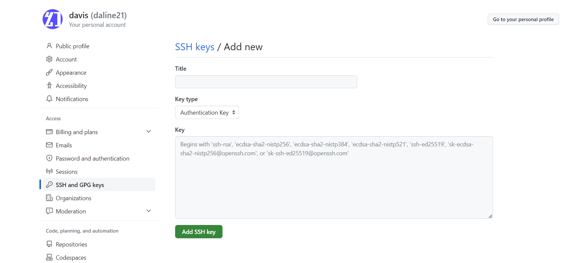

# 检查Git config是否配置

```shell
git config --global --list
```

# 配置Git用户名和邮箱

```shell
git config --global user.name "daline21"
git config --global user.email "2118523076@qq.com"
```

# 本地Windows生成SSH key

*Win+R并输入cmd按Enter键确认*<br>

进入目录

```shell
cd C:\Users\Administrator
```

参数写上自己的邮箱

```shell
ssh-keygen -t rsa -C "2118523076@qq.com"
```

# GitHub关联SSH
进入GitHub的个人设置，找到【SSH and GPG keys】， 然后点击新增SSH，进入如下界面，title输入你对于当前SSH key的备注，下面的key就粘贴上一步生成的id_rsa.pub内的内容


# 将https项目切换成ssh方式

```shell
git remote set-url origin git@github.com:daline21/davis-blog.git
```
